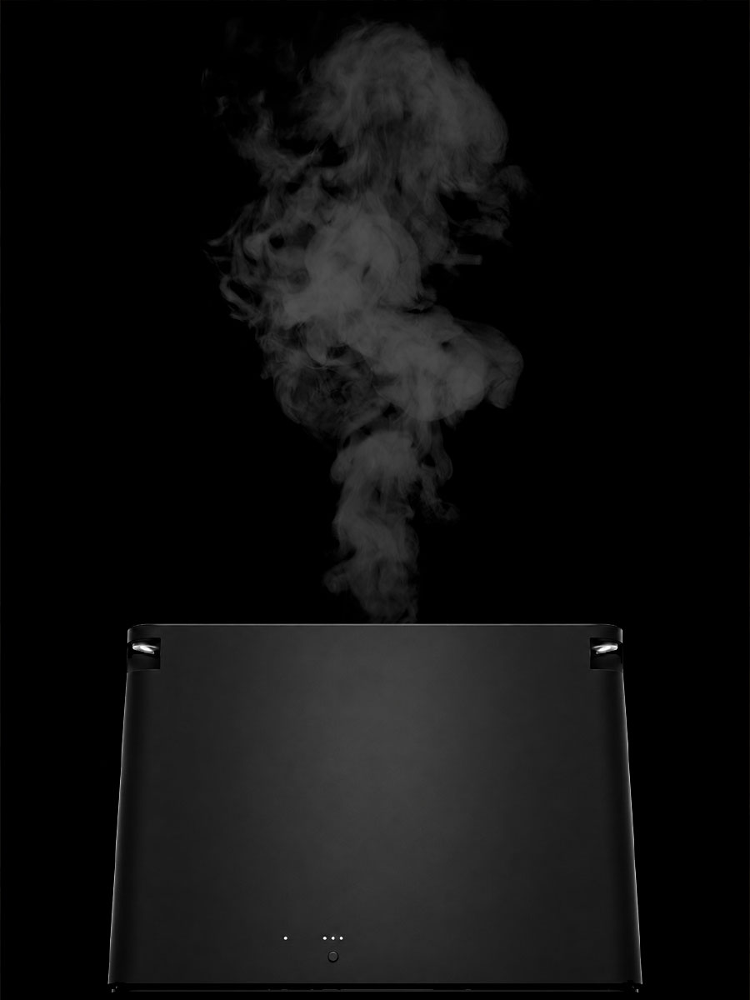

# 【Claude Code 引き継ぎ】STENA LP 導入部の改修

このドキュメント単体で作業が完結するように書いています。前提知識は不要です。

---

## 0. 背景と目的

STENA（スチーム式加湿器）のLP。導入部が「加湿が必要な理由」を3回証明して終わっており、**「だからスチーム式」の論拠が存在しない**まま結論セクション（`steam-answer`）に到達している。

このタスクでは導入部を5ブロックに再構成し、**「加湿器には方式が複数ある → 冬の寝室という条件ではスチーム式だけが要件を満たす」**という論理を通す。

```
【現状】共感 → 冬夏の水分量差 → 加熱で相対湿度低下 → だから乾く → スチームという答え
                                                                    ↑ 論理が飛ぶ
【改修後】① 共感 → ② 気づき（評価軸の宣言）→ ③ 再定義（方式という視点）
          → ④ 絞り込み（4方式比較）→ ⑤ 結論（スチームという答え）
```

---

## 1. 対象ファイル

公開URL: `https://feileb2.sakura.ne.jp/test/ue/preview.html`

| ファイル | 役割 |
|---|---|
| `preview.html` | 本体マークアップ |
| `css/code-lp.css` | 全スタイル（約113KB・単一ファイル） |
| `js/code-lp.js` | 全スクリプト（1,092行・IIFE の連なり） |

**作業前に必ずローカルの該当ファイルパスを確認すること。** 以降の行番号は改修前の状態を基準にしている。

---

## 2. 変更サマリ

| 対象 | 操作 |
|---|---|
| `steam-story`（①） | コピー差し替え＋スクラブ距離 380vh → **180vh** |
| `season-compare` | **完全削除**（HTML/CSS/JS すべて） |
| `heat-story`（②） | コピー差し替えのみ。**JSは変更不要**（後述） |
| `dry-morning` | **完全削除**。カラースクラブ機構は④末尾へ移植 |
| `method-intro`（③） | **新規作成** |
| `method-compare`（④） | **新規作成**（比較表＋モード切替スクラブ） |
| `steam-answer`（⑤） | 維持。製品画像のスクロール連動リビールを**追加** |

### 作業順序の注意

**行番号の大きいものから先に編集すること。** 上から編集すると以降の行番号がすべてずれる。
または行番号を使わず、本書に記載した**アンカー文字列**で位置特定すること（推奨）。

---

## 3. HTML の差し替え

### 3-1. 置換範囲

`preview.html` の **296行目$301C451行目**（改修前）。

- 開始アンカー：`<section class="steam-story" id="steamStory" aria-labelledby="steamStoryTitleA">`
- 終了アンカー：`steam-answer` セクションの閉じ `</section>`（直後に `<!-- メリットカード -->` が来る行の手前）

この範囲に含まれるのは `steam-story` / `season-compare` / `heat-story` / `dry-morning` / `steam-answer` の5セクション。**これを丸ごと下記に置き換える。**

### 3-2. 置換後のHTML

```html
  <!-- ①共感：朝の実感 -->
  <section class="steam-story" id="steamStory" aria-labelledby="steamStoryTitleA">
    <div class="steam-story__sticky">
      <canvas class="steam-story__canvas" id="steamCanvas" width="1470" height="1097"></canvas>
      <div class="steam-story__flatten steam-story__flatten--a" id="flattenA" style="opacity: 0;"></div>
      <div class="steam-story__flatten steam-story__flatten--b" id="flattenB" style="opacity: 0;"></div>

      <div class="steam-story__copy-stack">
        <div class="steam-story__copy" id="copyA" style="opacity: 0; --ink: rgb(32,59,74); --accent: rgb(26,143,173);">
          <h2 id="steamStoryTitleA" class="steam-story__title">
            朝、喉が渇いて<br><b>目が覚める</b>。
          </h2>
          <p class="steam-story__note">
            なんだか、よく眠れた気がしない。<br>
            冬になると、そんな朝が増える。
          </p>
        </div>
        <div class="steam-story__copy" id="copyB" aria-hidden="true" style="opacity: 0; --ink: rgb(42,69,82); --accent: rgb(47,142,170);">
          <h2 class="steam-story__title">
            毛布は暖かいのに、<br>空気だけが、冷たく乾いている。
          </h2>
        </div>
      </div>

      <div class="steam-story__hint" id="hint" style="opacity: 1;">SCROLL ↓</div>

      <div class="steam-story__wave" aria-hidden="true">
        <svg viewBox="0 0 1200 100" preserveAspectRatio="none" focusable="false">
          <path fill="var(--bg-cool)"
            d="M0,38 C180,38 320,88 600,88 C880,88 1020,38 1200,38 L1200,100 L0,100 Z"/>
        </svg>
      </div>
    </div>
  </section>

  <!-- ②気づき：評価軸の宣言 -->
  <section class="heat-story" id="heatStory" aria-labelledby="heatStoryTitle">
    <div class="heat-story__sticky" id="heatSticky">
      <div class="heat-field" id="heatField" aria-hidden="true"></div>
      <div class="heat-story__inner">
        <header class="heat-story__header">
          <p class="heat-story__bridge">寒いから、暖房をつける。</p>
          <h2 id="heatStoryTitle">でも空気は、<br><em id="heatDensityEm" class="is-warm">温めるほど</em><br>乾いていく</h2>
        </header>

        <div class="heat-stage" id="heatStage">
          <div class="heat-readout" aria-live="polite">
            <div class="heat-readout__item">
              <p class="heat-readout__label">室温</p>
              <p class="heat-readout__value" id="heatTempValue"><span id="heatTemp">15</span><small>℃</small></p>
            </div>
            <div class="heat-readout__sep" aria-hidden="true"></div>
            <div class="heat-readout__item">
              <p class="heat-readout__label">水分量</p>
              <p class="heat-readout__value heat-readout__value--fixed" id="heatMoistureValue">
                <small class="heat-readout__prefix">約</small>6.4<small>g/m$00B3</small>
              </p>
            </div>
            <div class="heat-readout__sep" aria-hidden="true"></div>
            <div class="heat-readout__item">
              <p class="heat-readout__label">湿度</p>
              <p class="heat-readout__value is-cool" id="heatHumidityValue"><span id="heatHumidity">50</span><small>％</small></p>
            </div>
          </div>
        </div>

        <p class="heat-story__lead">
          空気は、温度が高いほど多くの水分を含むことができます。<br>
          だから水分を足さないまま室温だけを上げると、湿度の数字は下がっていきます。
        </p>
        <p class="heat-story__result reveal" id="heatResult">
          冬の寝室は、暖かさと潤いを、<br>
          <em>切り離して考えられない</em>。
        </p>
        <p class="heat-story__dakara reveal reveal--scale" id="heatDakara" aria-hidden="true">だから</p>
      </div>
    </div>
  </section>

  <!-- ③再定義：方式という視点 -->
  <section class="method-intro" id="methodIntro" aria-labelledby="methodIntroTitle">
    <div class="lp-inner method-intro__inner">
      <h2 id="methodIntroTitle" class="method-intro__title reveal reveal--up">加湿器を置いた。<br>それでも、物足りない朝。</h2>
      <p class="method-intro__lead reveal reveal--up" data-reveal-delay="80">
        加湿器は使っている。数字の上では、湿度も足りている。<br>
        それなのに、部屋のうるおいを実感しきれない朝がある。
      </p>
      <p class="method-intro__lead reveal reveal--up" data-reveal-delay="160">
        その違いは、性能の高い・低いよりも、<br>
        <em>水を「どうやって」空気に届けるか</em>という、方式の差にあります。
      </p>
      <p class="method-intro__bridge reveal reveal--up" data-reveal-delay="280">加湿器には、大きく4つの方式があります。</p>
    </div>
  </section>

  <!-- ④絞り込み：4方式の比較＋モード切替 -->
  <section class="method-compare" id="methodCompare" aria-labelledby="methodCompareTitle">
    <div class="lp-inner method-compare__inner">
      <h2 id="methodCompareTitle" class="method-compare__title reveal reveal--up">空気に届くのは、<br>「冷たい霧」か、「温かい蒸気」か。</h2>

      <div class="method-table-wrap reveal reveal--up" data-reveal-delay="80">
        <table class="method-table">
          <caption class="u-visually-hidden">加湿方式ごとの、水の届け方と空気に届くもの</caption>
          <thead>
            <tr>
              <th scope="col">方式</th>
              <th scope="col">水の届け方</th>
              <th scope="col">空気に届くもの</th>
            </tr>
          </thead>
          <tbody>
            <tr>
              <th scope="row">気化式</th>
              <td data-label="水の届け方">水を含ませたフィルターに送風する</td>
              <td data-label="空気に届くもの">室温以下の、しめった風</td>
            </tr>
            <tr>
              <th scope="row">超音波式</th>
              <td data-label="水の届け方">水を振動で細かい粒にして飛ばす</td>
              <td data-label="空気に届くもの">冷たいミスト（水の粒）</td>
            </tr>
            <tr>
              <th scope="row">ハイブリッド式</th>
              <td data-label="水の届け方">気化式に温風を組み合わせる</td>
              <td data-label="空気に届くもの">気化した水分を含む風</td>
            </tr>
            <tr class="method-table__row--steam">
              <th scope="row">スチーム式</th>
              <td data-label="水の届け方">水をヒーターで加熱し、沸騰させる</td>
              <td data-label="空気に届くもの">100℃でつくられた、温かい蒸気</td>
            </tr>
          </tbody>
        </table>
      </div>

      <p class="method-compare__lead reveal reveal--up" data-reveal-delay="120">
        加熱しない方式が届けるのは、常温以下の風や、水の粒。<br>
        うるおいを足すことはできても、寝室の空気を暖める方向には working ません。
      </p>
      <p class="method-compare__result reveal reveal--up" data-reveal-delay="200">
        水そのものを加熱して蒸気に変えるスチーム式だけが、<br>
        <em>温かさと潤いを、同時に届けられます。</em>
      </p>
      <small class="method-compare__note">※各方式の一般的な特徴です。製品により構造・仕様は異なります。</small>
    </div>

    <!-- 編集モード（明）→ 製品モード（黒）への切り替えスクラブ -->
    <div class="method-outro__scrub">
      <div class="method-outro__sticky">
        <p class="method-outro__line">温かさと潤いを、同時に。</p>
      </div>
    </div>
  </section>

  <!-- ⑤結論：ここから製品モード（黒） -->
  <section class="steam-answer" id="steamAnswer" aria-labelledby="steamAnswerTitle">
    
    <div class="lp-inner">
      <header class="steam-answer__header">
        <p class="steam-answer__sub reveal reveal--up" data-reveal-delay="0">STENAの発想</p>
        <h2 id="steamAnswerTitle" class="reveal reveal--up" data-reveal-delay="80">乾きやすい冬の空気に<br>スチームという答え</h2>
        <p class="steam-answer__lead reveal reveal--up" data-reveal-delay="160">冬の寝室に必要なのは、湿度計の数字ではなく、<br>暖かく、潤った空気そのもの。</p>
        <p class="steam-answer__lead reveal reveal--up" data-reveal-delay="280">毎晩、長い時間を過ごす場所だから。<br>STENAは、水を100℃で沸かします。</p>
      </header>
    </div>
  </section>
```

> $26A0 上記④の lead 内に `working ません` という文字列がある。これは誤り。**`働きません` に修正すること。**

---

## 4. CSS の変更

### 4-1. 削除する範囲

`css/code-lp.css`（改修前の行番号）。**下から順に削除すること。**

| 範囲 | 見出しコメント | 操作 |
|---|---|---|
| 1899 $301C 2013 | `/* ===== 冬の朝・乾燥（sticky スクラブ…） ===== */` | 削除 |
| 1425 $301C 1706 | `/* ====== 冬・夏の水分量比較 ====== */` | 削除 |

削除後、`shared type` ブロック（277行付近）のセレクタリストに残る `.dry-morning h2` / `.season-compare h2` / `.season-compare__lead` / `.dry-morning__*` の記述も併せて除去し、代わりに `.method-intro__title` / `.method-compare__title` / `.method-compare__lead` を追加すること。

また `.heat-story__sticky, .dry-morning__sticky{...}`（1720行付近）の複合セレクタから `.dry-morning__sticky` を外す。

### 4-2. スクラブ距離の変更

```css
/* 1305行付近 */
.steam-story{
  height:180vh;   /* ← 380vh から変更 */
}

/* 1716行付近 */
.heat-story{
  height:170vh;   /* ← 200vh から変更 */
}
```

### 4-3. 追加するCSS

`/* ===== STENA 答え＋汎用カルーセル ===== */`（2014行付近）の**直前**に挿入する。

```css
  /* ===== ③方式という視点（編集モード） ===== */
  .method-intro{
    position:relative;
    padding:var(--section-pad-y) 0;
    background:var(--bg);
    color:var(--ink);
  }
  .method-intro__inner{
    width:min(var(--content-sm),100%);
    margin:0 auto;
    padding:0 var(--gutter-lg);
    text-align:center;
  }
  .method-intro__title{
    margin:0;
    font-size:var(--type-h-lg-size);
    font-weight:var(--type-h-lg-weight);
    line-height:var(--type-h-lg-lh);
    letter-spacing:var(--type-h-lg-ls);
  }
  .method-intro__lead{
    margin-top:var(--type-lead-lg-gap);
    font-size:var(--type-lead-lg-size);
    line-height:var(--type-lead-lg-lh);
    color:var(--ink-muted);
  }
  .method-intro__lead em{
    font-style:normal;
    font-weight:700;
    color:var(--ink);
  }
  .method-intro__bridge{
    margin-top:clamp(2rem,6vw,3rem);
    font-size:var(--type-lead-lg-size);
    font-weight:700;
    line-height:1.8;
    color:var(--ink);
  }

  /* ===== ④方式の比較（編集モード） ===== */
  .method-compare{
    --bt:0;                       /* 0=編集モード(明) / 1=製品モード(黒)。JSが更新 */
    position:relative;
    background:var(--bg);
    color:var(--ink);
  }
  .method-compare__inner{
    width:min(var(--content-md),100%);
    margin:0 auto;
    padding:var(--section-pad-y) var(--gutter-lg) 0;
    text-align:center;
  }
  .method-compare__title{
    margin:0;
    font-size:var(--type-h-lg-size);
    font-weight:var(--type-h-lg-weight);
    line-height:var(--type-h-lg-lh);
    letter-spacing:var(--type-h-lg-ls);
  }
  .method-table-wrap{
    margin-top:clamp(2rem,6vw,3rem);
  }
  .method-table{
    width:100%;
    border-collapse:collapse;
    text-align:left;
    font-size:var(--card-body-size);
    line-height:var(--card-body-lh);
  }
  .method-table th,
  .method-table td{
    padding:clamp(.9rem,3vw,1.15rem) clamp(.75rem,2.5vw,1rem);
    border-bottom:1px solid rgba(0,0,0,.10);
    vertical-align:top;
  }
  .method-table thead th{
    font-size:var(--type-note-size);
    font-weight:700;
    color:var(--ink-muted);
    letter-spacing:.04em;
    border-bottom:1px solid rgba(0,0,0,.22);
  }
  .method-table tbody th{
    font-weight:700;
    white-space:nowrap;
  }
  .method-table__row--steam th,
  .method-table__row--steam td{
    background:var(--bg-cool);
    font-weight:700;
    color:var(--ink);
  }

  /* SP：3カラムのままでは読めないためカード状に積む */
  @media (max-width:640px){
    .method-table thead{
      position:absolute;
      width:1px; height:1px;
      margin:-1px; padding:0;
      overflow:hidden; clip:rect(0 0 0 0);
      white-space:nowrap; border:0;
    }
    .method-table,
    .method-table tbody,
    .method-table tr,
    .method-table th,
    .method-table td{
      display:block;
      width:100%;
    }
    .method-table tr{
      margin-bottom:clamp(1rem,4vw,1.5rem);
      border:1px solid rgba(0,0,0,.12);
      border-radius:16px;
      overflow:hidden;
    }
    .method-table tbody th{
      padding:.85rem 1rem;
      background:rgba(0,0,0,.04);
      border-bottom:0;
      font-size:var(--card-title-size);
    }
    .method-table td{
      padding:.85rem 1rem;
      border-bottom:0;
    }
    .method-table td + td{
      border-top:1px solid rgba(0,0,0,.08);
    }
    .method-table td::before{
      content:attr(data-label);
      display:block;
      margin-bottom:.25rem;
      font-size:var(--type-note-size);
      font-weight:700;
      color:var(--ink-muted);
    }
    .method-table__row--steam{
      border-color:rgba(0,0,0,.28);
    }
    .method-table__row--steam tbody th{
      background:var(--bg-cool);
    }
  }

  .method-compare__lead{
    margin-top:var(--type-lead-lg-gap);
    font-size:var(--type-lead-lg-size);
    line-height:var(--type-lead-lg-lh);
    color:var(--ink-muted);
  }
  .method-compare__result{
    margin-top:clamp(1.25rem,4vw,1.75rem);
    font-size:var(--type-lead-lg-size);
    line-height:var(--type-lead-lg-lh);
    font-weight:700;
    color:var(--ink);
  }
  .method-compare__result em{
    font-style:normal;
  }
  .method-compare__note{
    display:block;
    margin-top:clamp(1rem,3vw,1.5rem);
    font-size:var(--type-note-size);
    line-height:var(--type-note-lh);
    color:var(--ink-muted);
  }

  /* ===== ④→⑤ モード切替スクラブ ===== */
  /* ★ scrubProgress() は「トラック高 $2212 ビューポート高」を分母にする。
     トラックは必ず 100vh より高くすること。125vh で実スクラブ距離 25vh。 */
  .method-outro__scrub{
    height:125vh;
    margin-top:var(--section-pad-y);
  }
  .method-outro__sticky{
    position:sticky;
    top:0;
    min-height:100svh;
    display:flex;
    align-items:center;
    justify-content:center;
    padding:0 var(--gutter-lg);
    background:var(--bg-dark);  /* color-mix 非対応時のフォールバック（ハードカット） */
    background:color-mix(in srgb, var(--bg), var(--bg-dark) calc(var(--bt) * 100%));
  }
  .method-outro__line{
    margin:0;
    text-align:center;
    font-size:var(--type-h-md-size);
    font-weight:var(--type-h-md-weight);
    line-height:var(--type-h-md-lh);
    letter-spacing:var(--type-h-md-ls);
    color:var(--ink-on-dark);   /* フォールバック */
    color:color-mix(in srgb, var(--ink), var(--ink-on-dark) calc(var(--bt) * 100%));
  }

  /* ===== ⑤製品リビール ===== */
  .steam-answer__bg{
    opacity:0;
    will-change:opacity, transform;
  }
```

### 4-4. ユーティリティの確認

`.u-visually-hidden` が既存にあるか確認し、なければ追加する。

```css
  .u-visually-hidden{
    position:absolute;
    width:1px; height:1px;
    margin:-1px; padding:0;
    overflow:hidden; clip:rect(0 0 0 0);
    white-space:nowrap; border:0;
  }
```

---

## 5. JS の変更

`js/code-lp.js` は IIFE の連なりで構成されている。**下から順に処理すること。**

### 5-1. 削除する IIFE

| 範囲（改修前） | 識別子 | 操作 |
|---|---|---|
| 880 $301C 948 | `document.getElementById('dryMorning')` | 削除（機構は 5-3 へ移植） |
| 520 $301C 677 | `document.getElementById('seasonCompare')` | 削除 |

### 5-2. `heatStory` の IIFE（679$301C755）は変更不要

`FROM = { temp: 15, humidity: 50 }` / `TO = { temp: 25, humidity: 28 }` が既に設定されており、**この数値は物理的に正しい**ので触らないこと。

> 検算：15℃の飽和水蒸気量 12.83 g/m$00B3 × 50% = 6.41 g/m$00B3。
> これを25℃（飽和 23.05 g/m$00B3）まで加温 → 6.41 ÷ 23.05 = **27.8% ≒ 28%**。

HTMLのラベルを「相対湿度」→「湿度」に変えているが、JSは `textContent` を書き換えるだけなので影響しない。

### 5-3. 追加する IIFE

削除した `dryMorning` の IIFE があった位置に、以下2つを挿入する。

```js
/* ④→⑤ 編集モード（明）→ 製品モード（黒）への切り替えスクラブ */
(() => {
  const section = document.getElementById('methodCompare');
  const scrub   = section && section.querySelector('.method-outro__scrub');
  if(!section || !scrub) return;

  const { range, scrubProgress, bindScroll } = window.LP;

  bindScroll(() => {
    const p = scrubProgress(scrub);
    /* easeInOut は使わない。前半は明るさを保ち、後半で一気に落とす「消灯カーブ」。
       段階的に暗くすると目が順応して黒のコントラストが失われるため。 */
    const bt = Math.pow(range(p, 0.45, 1.00), 1.8);
    section.style.setProperty('--bt', bt.toFixed(4));
  });
})();

/* ⑤ 製品画像のスクロール連動リビール */
(() => {
  const sec = document.getElementById('steamAnswer');
  const bg  = sec && sec.querySelector('.steam-answer__bg');
  if(!sec || !bg) return;

  const { clamp, bindScroll, reduceMotion } = window.LP;

  if(reduceMotion){
    bg.style.opacity = '1';
    bg.style.transform = 'translateX(-50%)';
    return;
  }

  bindScroll(() => {
    const vh = window.innerHeight;
    const r  = sec.getBoundingClientRect();
    /* セクション上端が画面下端に触れてから、画面高の70%進むまでを 0→1 */
    const p  = clamp((vh - r.top) / (vh * 0.7));
    bg.style.opacity   = p.toFixed(3);
    /* 既存CSSの translateX(-50%) を必ず維持すること（消すと中央寄せが崩れる） */
    bg.style.transform = 'translateX(-50%) scale(' + (1.06 - 0.06 * p).toFixed(4) + ')';
  });
})();
```

---

## 6. 設計意図（変更してはいけない理由）

実装中に「もっとこうした方が良さそう」と思ったとき、以下は**意図的にそうしている**ので変えないこと。

1. **①$301C④は明るい編集トーンを維持し、段階的にグレーへ降ろさない。**
   黒は「夜」ではなく「ここから製品の話」というレジスタ切り替えの合図。直前まで明るさを保つことが⑤の黒のコントラストを作る。グレーを刻んで降りると目が順応し、黒が「夕暮れの続き」として読まれて合図として機能しなくなる。

2. **④の比較表は横スライド（カルーセル）にしない。**
   購入判断のコア情報。カルーセルは2枚目以降の到達率が大きく落ちるため、全項目を同時に見せる。

3. **スクラブ区間（`.method-outro__scrub`）には比較表を入れない。**
   読んでいる最中に背景が変わると可読性が落ちる。スクラブ内は一行コピーのみ。

4. **`.method-outro__scrub` の高さを 100vh 以下にしない。**
   `scrubProgress()` は `offsetHeight $2212 viewportHeight` を分母にするため、100vh 以下だと常に 0 を返して演出が動かない。短くしたい場合は高さではなく `Math.pow()` の指数側で調整する。

5. **①の canvas と ④のスクラブを隣接させない。**
   間に③（静的セクション）が入ることでGPU負荷のピークが分散される。③に演出を足さないこと。

---

## 7. コピーの法務制約（絶対厳守）

比較表を扱うため、以下の表現を**追加・言い換えの過程で混入させないこと**。

| $2715 使用禁止 | 理由 |
|---|---|
| スチーム式が一番／一択／最強／No.1 | 不実証広告規制。合理的根拠資料の提出義務（15日以内）が生じる |
| 超音波式は雑菌が繁殖する／不衛生／危険 | 他方式の断定的な貶め。優良誤認・比較広告ガイドライン違反 |
| 部屋が暖かくなる／暖房代わりになる | 暖房器具ではないため優良誤認 |
| 喉を守る／喉の水分が奪われる | 雑貨で身体作用・効能を説明＝薬機法リスク |
| 風邪・ウイルス・インフルエンザ対策 | 医薬品的効能 |

**守るべき原則**：他方式については「加熱するか、しないか」という**構造上の事実の記述に留める**。優劣は「冬の寝室で選ぶなら」という**条件限定**の中でのみ語る。比較表に特定の製品名・ブランド名を出さない。

---

## 8. 受け入れ条件

以下をすべて満たすこと。

### 表示・動作

- [ ] iPhone相当（390×844）で①$301C⑤が上から順に表示され、レイアウト崩れがない
- [ ] `document.documentElement.scrollWidth === window.innerWidth`（横スクロールが発生していない）
- [ ] ①のcanvas演出が従来どおり動作する（コピーAからコピーBへ切り替わる）
- [ ] ②の数値が 15℃→25℃ / 50%→28% にスクロール連動で変化する
- [ ] ④の比較表がSPでカード状に積まれ、各セルに「水の届け方」「空気に届くもの」のラベルが表示される
- [ ] ④末尾でスクロールに応じて背景が白→黒へ変化し、⑤の黒背景に継ぎ目なく接続する
- [ ] ⑤で製品画像がスクロールに応じてフェードイン＋わずかに縮小し、`translateX(-50%)` が維持されている（中央寄せが崩れていない）

### コンソール・回帰

- [ ] JSエラーが1件も出ていない（`seasonCompare` / `dryMorning` の参照が残っていないこと）
- [ ] `preview.html` 内に `season-compare` / `dry-morning` の文字列が残っていない
- [ ] ④の lead が「働きません」になっている（`working ません` が残っていない）

### アクセシビリティ

- [ ] `prefers-reduced-motion: reduce` で⑤の製品画像が `opacity:1` で即表示される
- [ ] 比較表がキーボードで読め、`<caption>` と `scope` 属性が機能している

### 参考：想定される高さの変化

| | 改修前 | 改修後（目安） |
|---|---|---|
| ① steam-story | 2,523px（380vh） | 約1,195px（180vh） |
| season-compare | 1,186px | 削除 |
| ② heat-story | 1,328px | 約1,129px（170vh） |
| dry-morning | 1,062px | 削除 |
| ③ method-intro | $2014 | 約600px |
| ④ method-compare | $2014 | 約900px＋スクラブ約830px |
| ⑤ steam-answer | 571px | 571px |
| **合計** | **6,670px** | **約5,225px（▲22%）** |

> 注：以前の検討段階で「▲43%・約3,800px」と見積もっていたが、これは④のスクラブトラック（125vh ≒ 830px）を計上していなかった。**正しい見込みは約▲22%**。

---

## 9. 未対応（今回のスコープ外・別タスク）

依頼者から「後ほど対応する」と指示済み。今回は触らないこと。

- `doctor-comment`（見出し「加湿器は"方式"で選ぶべきです」）が製品モード（黒）の列に白で割り込んでいる。内容が③④と同一の主張のため、将来的に③/④への移設候補。
- `dry-stress`（見出し「冬の乾燥、そのまま放置していませんか？」）が編集内容ながら黒背景。
- 画像最適化：`rec2mov1.gif`（3.2MB）/ `safe4.gif`（1.9MB）/ `safe1.gif`（1.6MB）の動画化。
- カード画像の `width`/`height` 属性が実寸と不一致（`800×600` 指定に対し実ファイルは `520×610`）でCLSが発生している。
